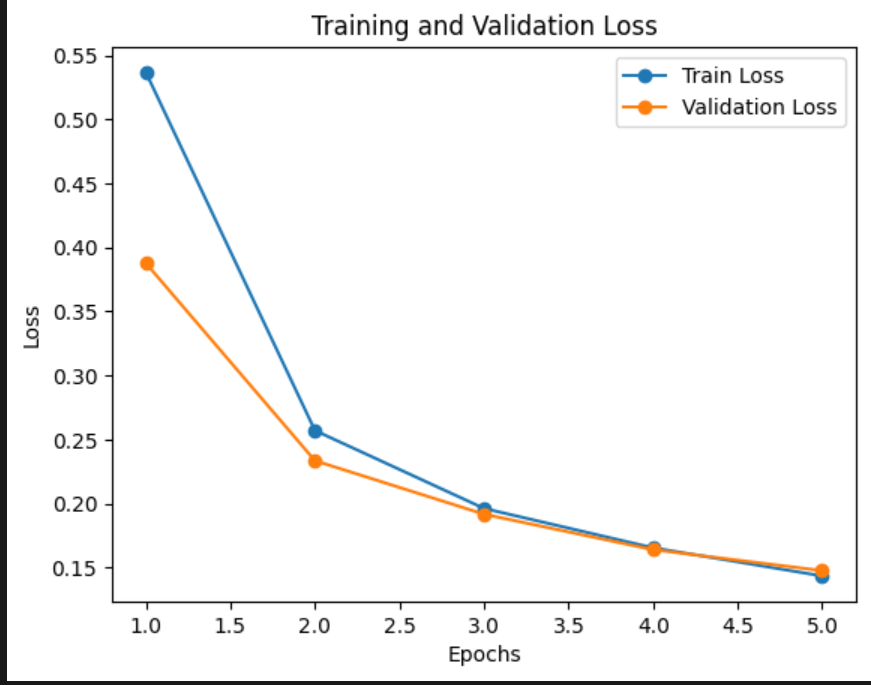
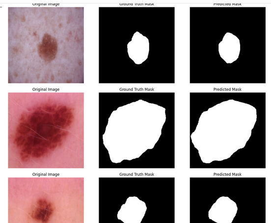

# 🩺 Skin Cancer Segmentation using U-Net

This project implements a deep learning model for automated segmentation of skin cancer lesions using a U-Net architecture with a pretrained EfficientNet-B0 encoder.

---

## 📋 Project Description

Skin cancer is one of the most common types of cancer worldwide. Early and accurate detection is crucial for effective treatment.

This project applies **semantic segmentation** to automatically identify and delineate lesion boundaries in dermoscopic images.

### 🔍 Model Overview

- **Architecture**: U-Net
- **Encoder**: EfficientNet-B0 (ImageNet pretrained)
- **Framework**: PyTorch with `segmentation_models_pytorch`
- **Task**: Binary segmentation (lesion vs background)

---

## 📊 Dataset

**HAM10000 Dataset** (Human Against Machine with 10,000 training images)

- **Source**: https://www.kaggle.com/datasets/surajghuwalewala/ham1000-segmentation-and-classification
- **Training Samples**: 8,012 images
- **Testing Samples**: 2,003 images
- **Image Format**: RGB dermoscopic images (.jpg)
- **Mask Format**: Binary segmentation masks (.png)
- **Image Size**: Resized to 256×256
- **Normalization**: ImageNet mean & std  
  mean = [0.485, 0.456, 0.406]  
  std = [0.229, 0.224, 0.225]

The dataset includes multiple lesion types with expert-annotated segmentation masks.

---

## 🚀 How It Works

### 1️⃣ Data Preprocessing

- Load RGB images and grayscale masks
- Resize all images to 256×256
- Normalize using ImageNet statistics
- Convert masks to binary format (0 = background, 1 = lesion)
- Split dataset into 80% training and 20% testing

---

### 2️⃣ Model Architecture
U-Net
├── Encoder: EfficientNet-B0 (pretrained on ImageNet)
│   └── Multi-scale feature extraction
│
├── Decoder: U-Net upsampling path
│   └── Skip connections for precise localization
│
└── Output: Single-channel binary mask


**Key Configuration:**

- Input Channels: 3 (RGB)
- Output Classes: 1
- Encoder Weights: ImageNet pretrained

---

### 3️⃣ Training Setup

- **Optimizer**: AdamW
- **Learning Rate**: 0.0001
- **Epochs**: 5
- **Batch Size**: Configurable
- **Loss Function**: Binary Cross-Entropy / Dice Loss
- **Device**: CUDA (if available) or CPU

---

## 📈 Loss Curve



The training and validation losses decrease steadily over epochs, indicating stable convergence.

---

## 🔍 Sample Predictions



The visualization includes:

- Original Image  
- Ground Truth Mask  
- Predicted Mask  

---

## 📊 Results Analysis

The model demonstrates stable learning behavior:

- Training and validation losses decrease consistently.
- Predicted masks align closely with lesion boundaries.
- The model generalizes across various lesion sizes and skin tones.

### Evaluation Metrics (Test Set)

| Metric | Score |
|--------|-------|
| Dice Score | 0.9427 |
| IoU (Jaccard) | 0.8979 |
| Pixel Accuracy | 96.92% |

Although trained for only 5 epochs, the model achieves strong segmentation performance with a Dice score of 0.94 and IoU of 0.90.

---

## 💻 Installation

### Prerequisites

- Python 3.8+
- pip
- CUDA-capable GPU (recommended but optional)

---

### Setup

```bash
git clone <YOUR_REPOSITORY_URL>
cd SkinCancer_Segmentation

python -m venv venv
source venv/bin/activate   # Windows: venv\Scripts\activate

pip install -r requirements.txt
```

---

## 📝 Usage

```bash
jupyter notebook SkinCancer_Segmentation_SMP_UNet.ipynb
```

---

## 🎯 Future Improvements

- [ ] Add data augmentation (rotation, flip, color jitter)
- [ ] Experiment with different encoders (ResNet, MobileNet)
- [ ] Implement ensemble methods
- [ ] Add cross-validation
- [ ] Deploy as a web application
- [ ] Optimize inference speed
- [ ] Add multi-class segmentation support

## 📚 References

- **Segmentation Models PyTorch**: [qubvel/segmentation_models.pytorch](https://github.com/qubvel/segmentation_models.pytorch)
- **U-Net Paper**: [Ronneberger et al., 2015](https://arxiv.org/abs/1505.04597)
- **HAM10000 Dataset**: [Tschandl et al., 2018](https://arxiv.org/abs/1803.10417)
- **EfficientNet**: [Tan & Le, 2019](https://arxiv.org/abs/1905.11946)

## 📄 License

This project is open source and available .


## 📧 Contact

For questions or feedback, please open an issue on GitHub.

---

**Note**: Make sure to download the HAM10000 dataset before running the notebook. The notebook uses `kagglehub` to automatically download the dataset from Kaggle.
