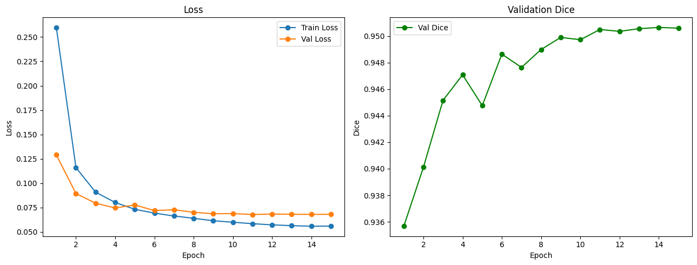
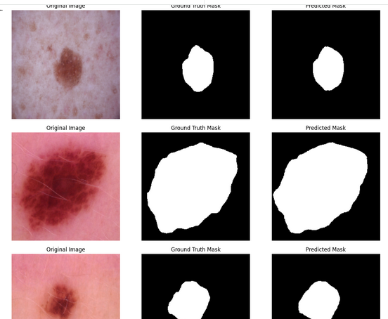

# Skin Cancer Segmentation using U-Net

This project trains a U-Net model to segment skin lesions in dermoscopic images from the HAM10000 dataset. The encoder is EfficientNet-B0 with ImageNet weights. Training and evaluation are done in a Jupyter notebook.

## Overview

The goal is binary semantic segmentation: predict a mask that separates the lesion from the background. Images are resized to 256×256 and normalized with ImageNet statistics. The model is built with PyTorch and `segmentation_models_pytorch`.

## Dataset

**HAM10000** (Human Against Machine with 10,000 training images)

- Source: https://www.kaggle.com/datasets/surajghuwalewala/ham1000-segmentation-and-classification
- Training samples: 8,012
- Test samples: 2,003
- Images: RGB dermoscopic `.jpg` files
- Masks: binary `.png` files (0 = background, 1 = lesion)
- Input size: 256×256
- Normalization (ImageNet):
  - mean = [0.485, 0.456, 0.406]
  - std = [0.229, 0.224, 0.225]

The notebook downloads the dataset with `kagglehub`. You need Kaggle API credentials configured before running it.

## Method

### Data preprocessing

- Load paired images and masks
- Resize to 256×256
- Normalize with ImageNet mean and std
- Split into 80% train / 20% test with a fixed random seed
- Keep image/mask pairs aligned during splitting and augmentation

### Model

- Architecture: U-Net
- Encoder: EfficientNet-B0 (ImageNet pretrained)
- Decoder: standard U-Net upsampling path with skip connections
- Input: 3-channel RGB
- Output: 1-channel binary mask

### Training

- Loss: combined BCE + Dice (`BCEDiceLoss`, equal weighting)
- Optimizer: AdamW (lr = 1e-4, weight decay = 1e-4)
- Scheduler: cosine annealing over 15 epochs
- Batch size: 16
- Augmentation: applied on the training set only (Albumentations; geometric transforms on image and mask together)
- Checkpoint: best model saved by validation Dice to `best_model.pth`
- Device: CUDA if available, otherwise CPU

## Results

Test set metrics from the improved notebook:

| Metric | Score |
|--------|-------|
| Dice Score | 0.9506 |
| IoU (Jaccard) | 0.9059 |
| Pixel Accuracy | 97.32% |

Training and validation loss decreased over 15 epochs.



Sample outputs: original image, ground truth mask, and predicted mask.



## Setup

Requirements:

- Python 3.8+
- pip
- GPU recommended (optional)

Install dependencies:

```bash
git clone <YOUR_REPOSITORY_URL>
cd SkinCancer_Segmentation_

python -m venv venv
source venv/bin/activate   # Windows: venv\Scripts\activate

pip install segmentation_models_pytorch kagglehub scikit-learn albumentations torch torchvision matplotlib pandas pillow
```

If your repo includes `requirements.txt`, you can use `pip install -r requirements.txt` instead.

## How to Run

1. Set up Kaggle credentials so `kagglehub` can download the dataset.
2. Open and run the notebook from top to bottom:

```bash
jupyter notebook SkinCancer_Segmentation_SMP_UNet_improved.ipynb
```

Use a GPU runtime if possible. On Google Colab: Runtime → Change runtime type → GPU.

## Future Work

- Try other encoders (ResNet, MobileNet, etc.)
- Add k-fold cross-validation
- Compare ensemble or post-processing methods
- Build a simple web demo for inference
- Speed up inference for larger images

## References

- Segmentation Models PyTorch: [qubvel/segmentation_models.pytorch](https://github.com/qubvel/segmentation_models.pytorch)
- U-Net: [Ronneberger et al., 2015](https://arxiv.org/abs/1505.04597)
- HAM10000: [Tschandl et al., 2018](https://arxiv.org/abs/1803.10417)
- EfficientNet: [Tan & Le, 2019](https://arxiv.org/abs/1905.11946)

## License

This project is open source. See the repository for license details.

## Contact

For questions or feedback, open an issue on GitHub.
